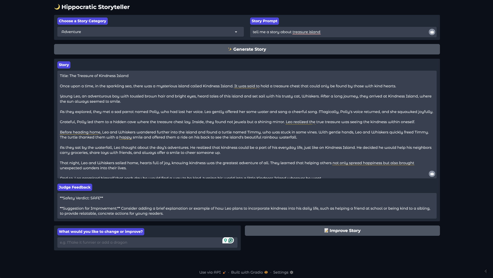
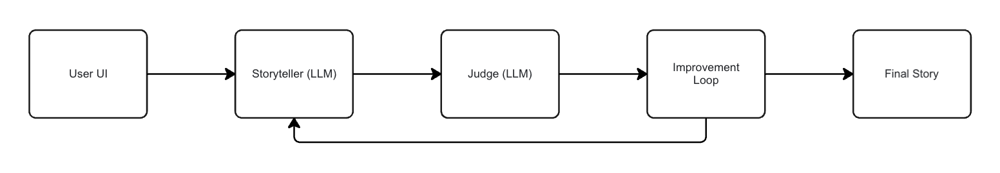

# 🌙 Hippocratic AI Bedtime Story Generator

An **AI-powered interactive bedtime story generator** for children aged 5–10.  
This project uses OpenAI's GPT-4o model to generate short, engaging, safe, and moral-rich stories, with a built-in “judge” to provide feedback and iterative improvements.

---

## Features

- 🎨 **Story Generation**: Generate short bedtime stories with a clear story arc.
- 🧙 **Ethical Story Judge**: Automatically evaluates the story for safety, age-appropriateness, and creativity.
- 🔁 **Iterative Improvement**: Users can give feedback to refine the story.
- 🎲 **Category Selection**: Choose from Adventure, Fantasy, Mystery, Animal Tales, Friendship, or let it pick randomly.
- 🌐 **Web Interface**: Lightweight Gradio-based UI for an interactive browser experience.

---

## Demo



---

## Diagram
  

## Installation

1. Clone the repository:
```bash
git clone https://github.com/<your-username>/hippocratic-bedtime-ai.git
cd hippocratic-bedtime-ai
```
2. Create a virtual environment (optional but recommended):
```bash
python -m venv venv
source venv/bin/activate  # Linux/macOS
venv\Scripts\activate     # Windows
```
3. Install dependencies:
```bash
pip install -r requirements.txt
```
4. Create a .env file in the root with your OpenAI API key:
```bash
OPENAI_API_KEY=your_openai_key_here
```

## Usage
Run the Gradio web interface:
```bash
python story_app.py
```
- Select a category or choose “Random”
- Enter a story prompt
- Generate your story
- Provide optional feedback to refine the story iteratively

## Testing
Unit tests are included and can be run with pytest:
```bash
pytest -v
```

## Technologies Used
- Python 3.9+
- OpenAI GPT-4o
- Gradio for the web interface
- Python-dotenv for environment variable management
- Pytest for unit testing

## Future Improvements
- Add story history sidebar to view previous iterations.
- Integrate voice narration for generated stories.
- Add downloadable PDF export of the stories.
- Include more categories and story templates.